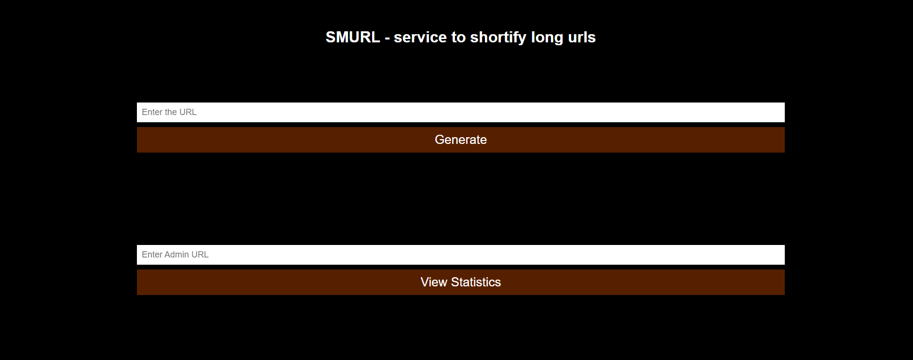

# smurl 
## Description
smurl (short for small url) is a service that allows the user to turn a long, cumbersome url address into a beautiful, convenient little link that can be easily used on social network pages, websites, etc. The service also allows you to track the statistics of clicks and clicks on short links for further analysis of the effectiveness of their use.
Chi was chosen as a router because of its idiomatic nature, speed, compliance of handlers with the standard library, sufficiency of tools, lack of hidden context, and a large number of standard middleware.

The API implements 4 main endpoints:
- GET /-home page
- GET /{small_url} -search for a small url, update statistics, redirect to the corresponding long address
- POST /create -creating a small url, creating an admin url, writing information about a small, admin and long url to the database
- POST /stat -get statistics on clicks on the received admin url

Postgresql database selected as storage

## HOWTO

- launch with `make launch`

To start, you need to enter the command: make launch (there will be a check with linters, testing, creating an executable file, starting the service in docker-compose)

Implementation on heroku.com at https://sanrise-smurl.herokuapp.com/

## Screenshot

 
